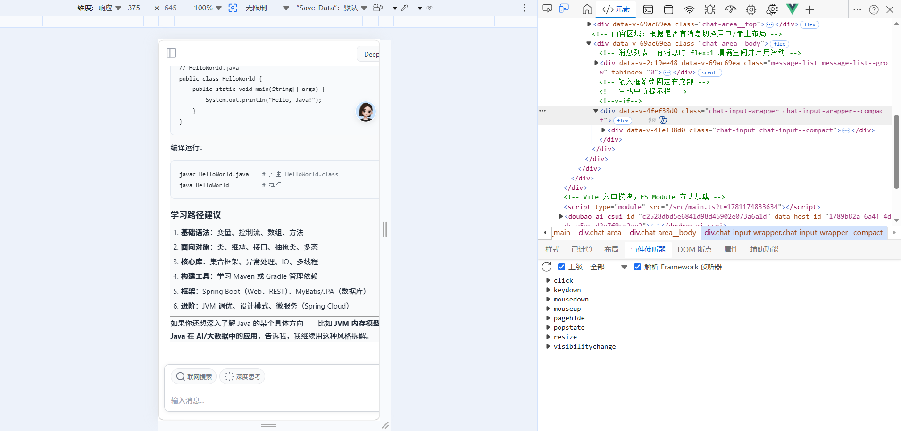

# AI Chat

全栈 AI 对话应用 · Vue 3 前端 + Fastify 5 后端，对接 DeepSeek API。

支持流式输出、Markdown 渲染、文件上传、记忆沉淀、定时任务、联网搜索、多 Agent 演示。

## 截图



## 功能

**核心对话**

- 多轮对话 + SSE 流式输出 + 打字机效果
- Markdown 渲染 + 代码语法高亮（14 种语言）
- 深度思考模式（deepseek-reasoner）
- 联网搜索（Tavily，结果自动清洗后注入上下文）
- 工具调用（当前时间 / 计算器 / 网页搜索，流式展示调用过程）
- 停止生成 / 继续生成

**会话与文件**

- 会话管理：新建 / 重命名 / 删除，列表虚拟滚动
- 历史会话页：按日期分组、滚动加载、多选批量删除
- 文件上传：图片 / PDF / Word / 代码，文档自动解析后参与对话

**记忆与智能**

- 跨标签记忆：自动提取用户关键信息（身份 / 住址 / 喜好），对话中智能注入
- 系统提示词自定义，支持 `{{user_name}}` / `{{date}}` 变量替换
- Token 预算：上下文超限自动裁剪（滑动窗口）

**任务与体验**

- 定时任务：once / daily / weekly / monthly，后台自动执行并把结果写入会话
- 多模型切换与校验（名称相近时智能提示）
- 全局暗色 / 亮色主题，切换持久化
- 移动端适配（375px 屏幕，侧边栏抽屉模式）
- JWT 注册 / 登录，路由守卫

## 技术栈

| 层 | 技术 |
| --- | --- |
| 前端 | Vue 3 + TypeScript + Vite + Pinia + Vue Router + Element Plus + Less |
| 后端 | Fastify 5 + TypeScript + better-sqlite3 + JWT + Zod |
| AI | DeepSeek API（OpenAI SDK 兼容）+ tiktoken 上下文预算 |
| Agent | LangGraph 多 Agent Swarm + 工具注册中心 |
| 部署 | Docker + docker compose + GitHub Actions CI/CD |

## 架构

```
┌─ 前端 ai-chat-vue (Vue 3 · :3000) ─────────────────────────┐
│ ChatPage │ HistoryPage │ TaskPage │ SettingsPage │ AgentPage │
│   └─ Pinia Store（会话 / 认证 / 配置 / 主题 / 任务）          │
│   └─ services/api.ts（fetch 封装 + SSE 流式解析）            │
└──────────────┬─────────────────────────────────────────────┘
               │ REST + SSE（JWT 认证 · :4000）
┌──────────────┴─────────────────────────────────────────────┐
│ 后端 ai-chat-server (Fastify 5)                            │
│   routes   auth / conversations / messages / chat / files  │
│            memories / models / user / tasks                │
│   services chat（上下文构建）/ deepseek（流式）/ memory     │
│            file（文档解析）/ search（Tavily）/ task         │
│   agents   LangGraph Swarm 多 Agent + 工具注册中心          │
│   scheduler 每分钟轮询执行定时任务                          │
│   plugins  JWT / 限流 / CORS / 统一错误处理 / 指标          │
│   data     SQLite（ai-chat.db）+ 文件存储（data/files）     │
└─────────────────────────────────────────────────────────────┘
```

## 快速开始

### 本地开发

```bash
cp ai-chat-server/.env.example ai-chat-server/.env   # 填入 DEEPSEEK_API_KEY / JWT_SECRET
pnpm install
pnpm dev                                             # 后端 :4000 + 前端 :3000
```

浏览器打开 http://localhost:3000，注册账号即可使用。

### Docker 部署

```bash
cp ai-chat-server/.env.example ai-chat-server/.env   # 填入 DEEPSEEK_API_KEY
docker compose up -d                                 # 开发环境
docker compose -f docker-compose.yml -f docker-compose.prod.yml up -d   # 生产环境
```

数据持久化在 `./data`，容器重建不丢数据。部署流程见 `.github/workflows/ci-cd.yml`。

## 目录结构

```
ai-chat/
├── ai-chat-server/       # 后端（Fastify 5 + SQLite）
│   └── src/
│       ├── routes/       # API 路由
│       ├── services/     # 业务服务（对话 / 记忆 / 文件 / 搜索 / 任务）
│       ├── agents/       # 多 Agent Swarm + 工具注册
│       ├── scheduler/    # 定时任务调度器
│       └── plugins/      # JWT / 限流 / 错误处理等插件
├── ai-chat-vue/          # 前端（Vue 3 + Vite）
│   └── src/
│       ├── pages/        # 页面（对话 / 历史 / 任务 / 设置 / 多 Agent）
│       ├── components/   # 组件（消息 / 输入 / 侧边栏 / Markdown 等）
│       ├── stores/       # Pinia（会话 / 认证 / 配置 / 主题）
│       └── services/     # API 客户端 + SSE 流式
├── data/                 # SQLite 数据库 + 上传文件
├── scripts/              # 环境初始化 / 备份脚本
└── docker-compose*.yml   # 容器编排
```

## API 概览

| 方法 | 路径 | 说明 |
| --- | --- | --- |
| POST | `/api/auth/register` · `/api/auth/login` | 注册 / 登录 |
| GET/POST | `/api/conversations` | 会话列表（游标分页）/ 创建 |
| PATCH/DELETE | `/api/conversations/:id` | 更新 / 删除会话 |
| GET/POST | `/api/conversations/:id/messages` | 消息列表（分页）/ 保存 |
| POST | `/api/conversations/:id/chat/stream` · `/stop` · `/continue` | SSE 流式对话 / 停止 / 续写 |
| POST | `/api/files/upload` | 文件上传 |
| GET/POST/DELETE | `/api/memories` | 记忆管理 |
| GET/POST | `/api/models` · `/api/models/validate` | 模型列表 / 校验 |
| GET/PUT | `/api/user/settings` | 用户设置（系统提示词） |
| GET/POST | `/api/tasks` | 定时任务 |
| GET | `/api/health` | 健康检查 |

完整接口文档见 [ai-chat-server/API.md](ai-chat-server/API.md)。

## 相关文档

- [后端 API 文档](ai-chat-server/API.md)
- [TODO / 开发路线图](todo.md)
- [VueFlow 使用总结](ai-chat-vue/docs/VueFlow用法总结.md)

## 许可证

[MIT](LICENSE)
